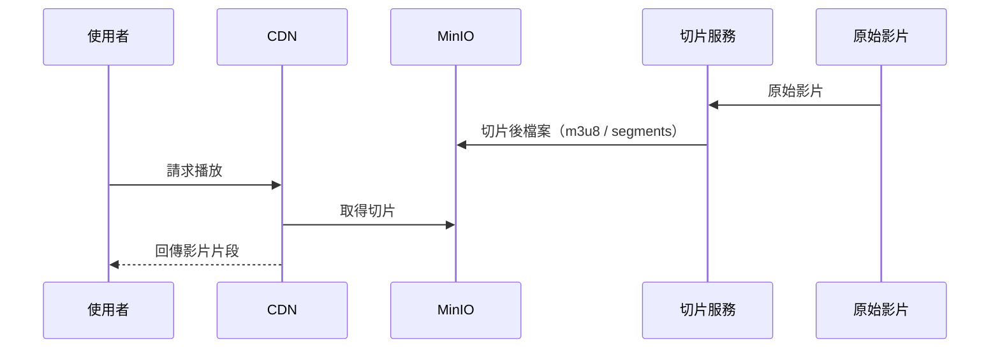

如果你平常在用公有雲，很容易會產生一個錯覺：

> 影片就放 S3，前面接 Cloudfront，不就好了？
> 

在一般網站、一般內容，這句話幾乎是對的

但只要內容一變成成人站、灰產、邊緣產業，這整套假設會瞬間崩掉

問題不是技術，而是**信任關係不存在**

對雲服務商來說，你的內容不是「流量」，而是「風險」

所以帳號被風控、Bucket 被封、CDN 被停，都不是意外，而是遲早會發生的事情

## 核心前提：先把命從公有雲拿回來

成人站的第一個前提通常不是「效能怎麼做」，而是：

> 怎麼把串流服務私有化到自己能控制的範圍內
> 

你可以用雲、可以租機、可以用各種代管資源，但重點是：

你的影片服務不能建立在「對方今天心情好」上面

## 第一步：切片，讓影片變成可快取的形狀

如果你手上有一批影片，想要讓使用者穩定播放，實務上你會很快發現：

影片根本不可能用「一個檔案」的方式去服務流量

真正能撐住流量的串流，第一步是**切片**

切片本質上不是單純轉檔，而是把一支完整影片，拆成很多可以獨立請求的小片段，再用一個索引檔（像 m3u8）把它們串起來。播放器實際上不是在「播影片」，而是在不停抓下一段、再下一段

這樣做的好處非常務實：

- 使用者可以快轉、拖拉，不需要重抓整支影片
- 某一段失敗可以補抓，不會整段中斷
- 最重要的是：**這些小片段非常適合被 CDN 快取**

沒有切片，就沒有真正的串流；沒有串流，就撐不住規模

## 第二步：MinIO 存儲桶，把 S3 模型搬回自己手上

影片切好之後，下一個問題就是：這些檔案要放哪？

在成人站的世界裡，答案幾乎不會是「某家大廠的物件儲存」。

不是因為功能不夠，而是因為你永遠不知道哪一天會被清掉。

所以實務上常見的路線是：

> 用 S3 相容的介面，但存儲一定要在自己能掌控的地方。
> 

MinIO 就是在扮演這個角色。

它提供的是 Bucket / Object / Access Key / API 這種大家熟悉的 S3 使用模型，差別只在於：

- 你知道資料放在哪
- 你知道誰能碰
- 哪天出事，是你自己決定要不要停，而不是被通知「已停用」

對成人站來說，MinIO 不是為了省錢，也不只是為了效能，而是為了**活得久一點**

## 第三步：CDN，把流量擋在存儲外面

到這裡如果你讓所有使用者直接連 MinIO，就算有切片，結局通常也不會太好：

- 頻寬會炸
- 延遲會爛
- 後端存儲會被打成瓶頸

所以第三個角色一定會出現：**CDN**。

成人站用 CDN，跟一般網站不太一樣，重點不是「全球加速」這種漂亮話，而是：

- 把大量請求擋在外面
- 讓切片檔案留在邊緣節點
- 讓後端存儲只面對「必要流量」

在這個產業裡，會有人提供「願意接這類內容」的 CDN 與相關服務

## 串起來：整體串流流程長什麼樣？

把三個角色接起來，其實流程非常直白：

這張圖背後的核心概念只有一個：使用者永遠接觸不到你的核心資源

他們只會看到 CDN，不會看到存儲位置，也碰不到原始影片

## 你不是在做串流，你是在做「可控性」

成人站的串流系統看起來像一套技術方案，但它真正解的其實不是效能，而是：

在一個你不被信任的世界裡，怎麼把可控性拿回來

切片只是讓影片「能播」；

MinIO 是把內容「握在自己手上」；

CDN 則是把流量「擋在核心之外」

這三個東西串起來之後，你會得到一個很現實的結果：

- 你不再依賴大廠的容忍
- 你的服務不會因為一封通知信就直接消失
- 你可以自己決定要撐、要擴、要關

所以成人站不是在拼「雲上架構做得多漂亮」，而是在拼：

出了事，你還能不能活下來？

當你理解這條鏈路的目的，你就會發現

串流只是表層，真正的核心是「生存的工程」