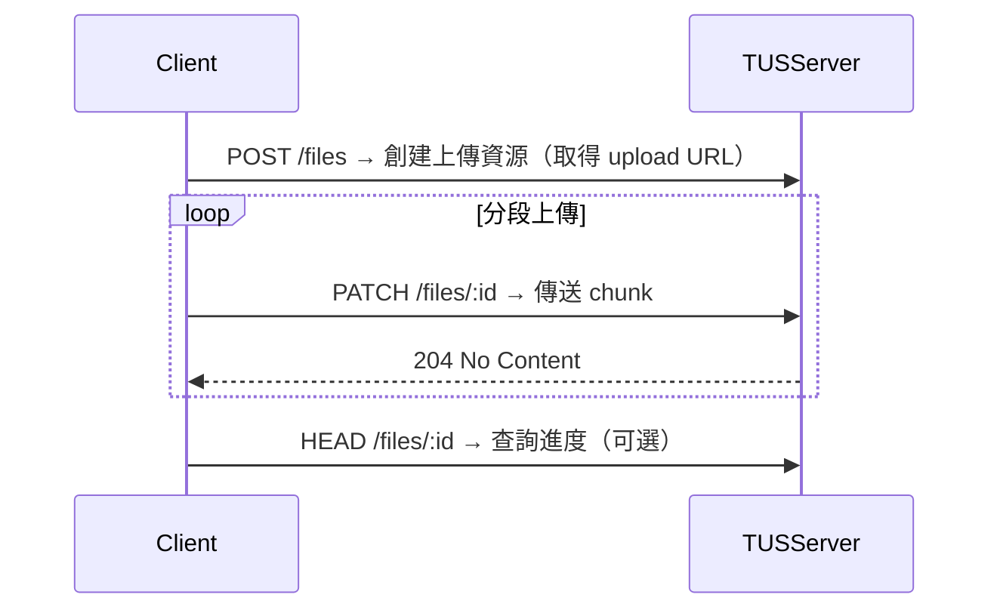

「上傳檔案」這個需求，幾乎每個產品都會遇到：

- 使用者要上傳頭像
- 客戶上傳報表或 JSON
- 管理後台要支援多個影片素材、PDF、原始圖檔

乍看之下，好像就是表單加個 `<input type="file" />` 的事。

> **但真的做過你就知道，檔案上傳是一場關於 bit & byte 的戰爭**
>
> 而且這場戰爭的勝負，不在程式碼寫得多漂亮，而在你有沒有搞懂每個方案的「場景邊界」

這篇來聊聊我自己在幾個專案裡踩過的坑，從小檔案的基本做法，到大檔案／斷線重傳場景的處理，再到一個經典的架構抉擇：**檔案到底應不應該經過你的後端伺服器？**

## 小檔案上傳，真的就只是「接個表單」嗎？

先從最基本的說起

**小檔案上傳流程**，就是你平常最常看到的那種：

```
使用者選檔案 → 前端 form / fetch / axios 傳到後端 → 後端接收存檔
```

### 前端在做什麼？

- `<input type="file">` 拿到 `File` 物件
- 用 `FormData.append("file", file)` 包起來
- `axios.post("/upload", formData)` 丟到後端

### 後端在做什麼？

- 用 multer（Node.js）或其他 multipart parser 解開
- 存進硬碟、S3、或其他儲存服務

這一段有個關鍵詞：**multipart/form-data**。
這是大多數瀏覽器傳檔案時的預設編碼格式

### 這個方案夠用嗎？

對小圖、PDF、音訊檔，都很 OK

> **但它的場景邊界非常清楚：檔案小、網路穩、不需要進度條**

你一遇到以下情況，這個方案的代價就會瞬間浮現：

- 使用者上傳 2GB 的影片 → Server memory 直接炸開
- 傳到一半網路斷了 → 使用者必須從 0% 重來，怒關你的網站
- 上傳過程沒進度條 → 使用者不知道是當機還是還在跑，狂按 F5
- Server timeout 壓力 → 一個大檔案卡住整個 request queue

## TUS 協議，大檔案／斷網重傳的場景救星

第一次遇到上傳大檔的需求時，工程師的直覺反應一定是：「來切 chunk 吧」

- 檔案切成 N 段
- 一段一段傳
- 全部傳完再合併

這聽起來很合理，也有很多 DIY 的土砲實作

但後來我們選擇了一個標準協議：**TUS (tus.io)**。

### TUS 是什麼？

> TUS 不是某個框架，也不是某個套件，它是一個專門為「斷點續傳」與「大檔案上傳」而生的**開放協議**
>
> 它定義了一套標準的 HTTP 溝通約定，讓客戶端和伺服器端都知道：上傳到哪了、能不能續傳、還剩多少

### TUS 的核心設計（這幾個特性救了我們）：

- **斷線重傳**：傳到一半斷線，不用重傳整包，從中斷點繼續
- **暫停／恢復**：使用者可以暫停上傳，關掉瀏覽器，明天打開繼續
- **進度查詢 API**：前端可以即時問伺服器「我到哪了」，做出真實的進度條
- **跨平台**：前端、行動裝置、桌面應用都能用同一套協議

### TUS 流程概念圖：



### 實作選項

- **前端**：官方有 `tus-js-client`，幾行程式碼就能接上
- **後端**：Node.js 可用 `tus-node-server`，或用 nginx 的 `tus` module
- **第三方**：也可以用 Uppy + tusd 的組合

### TUS 解決了什麼？

| 痛點 | 傳統 multipart 上傳 | TUS |
| :--- | :--- | :--- |
| 斷線重傳 | 從頭來過 | 從中斷點繼續 |
| 記憶體壓力 | 伺服器一次吃整包 | 分段接收，壓力極小 |
| 進度條 | 難做，只能模擬 | 原生支援查詢 API |
| 暫停／繼續 | 不支援 | 原生支援 |

---

## 檔案到底要不要經過自己的後端？（終極 Trade-off）

這是一個老問題，永遠沒有絕對答案，但**場景邊界極其明確**

你會看到兩種流派：

### 流派 A：檔案直接上傳到第三方儲存服務（S3 / Cloudflare R2）

流程是這樣：

1. 前端先 call 你的 API，拿一個**預簽名 URL（Presigned URL）**
2. 使用者直接把檔案透過那個 URL 丟到 S3
3. 上傳完成後，前端再回報 metadata 給你的系統

**這個方案的優勢：**
- 不經過你後端，頻寬成本幾乎為 0
- 後端不會被大檔案打死，架構更接近 serverless 哲學
- 上傳速度取決於 S3，不佔用你伺服器的連線數

**這個方案的代價：**
- 前端流程變複雜（要先拿 URL、要處理 S3 的回應）
- 權限控管必須靠 URL 有效期與 scope 精準控制
- 檔案驗證（副檔名、大小、MIME type）全部轉移到前端或非同步處理

### 流派 B：檔案先丟後端，再由後端存到儲存服務

這是比較「傳統、可控」的作法

**這個方案的優勢：**
- 你需要即時分析／過濾檔案（例如掃毒、轉檔、壓縮）
- 需要同步寫 DB log 紀錄每次上傳內容
- 想統一錯誤處理機制與 log pipeline

**這個方案的代價：**
- 後端直接承受頻寬與記憶體壓力
- 大檔案場景下，需要額外處理 timeout 與記憶體控管
- 伺服器頻寬成本高

> **選擇的關鍵不是「哪個技術比較潮」，而是你的業務場景需要「可控」還是「省錢」**

## 從 file input 到資料流設計，PM 能懂多少就差多少

做過檔案上傳的人都知道，這件事情從 UI 角度看真的不複雜

但一旦要處理大檔案、中斷重傳、後端壓力控制、CDN 邊界、權限驗證、資料入庫……你會發現這根本不是單純「接個表單」的問題

以前當 PM 的時候我也會說：
> 「就給我一個上傳按鈕，檔案丟上去就好。」

但現在回頭看，真的懂一點技術背後的「為什麼」，會讓你少問很多笨問題，也能早一步預判風險在哪：

- 上傳會不會拖慢主流程？（同步 vs. 非同步）
- 使用者上傳失敗怎麼辦？能不能續傳？（TUS or not）
- 檔案要經過我們後端？還是直接傳到儲存服務？（流派 A or B）
- **哪一段才是我們要負責控管的責任邊界？**

你不需要會手寫 chunk uploader
但你需要知道，**這不是單純在傳檔案，這是在管理風險與責任邊界**