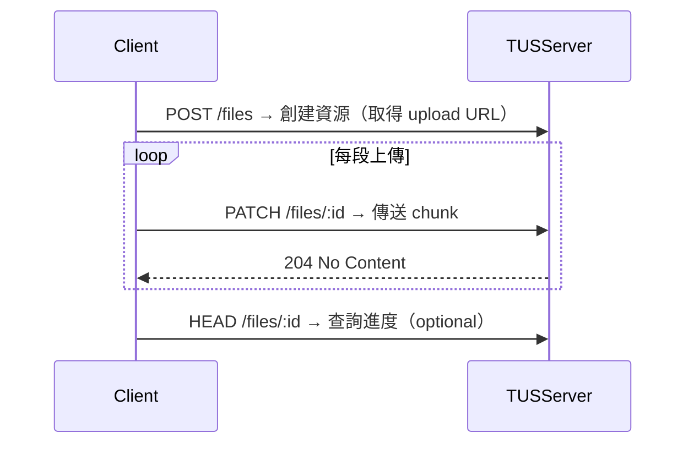

「上傳檔案」這個需求，幾乎每個產品都會遇到：

- 使用者要上傳圖片、大頭貼
- 客戶上傳報表或 JSON
- 管理後台支援多個影片素材、PDF、原始圖檔

乍看之下，好像就是表單加個 `<input type="file" />` 的事

但真的做過你就知道，**檔案上傳是一場關於 bit & byte 的戰爭**。

這篇來聊聊我自己在幾個專案裡踩過的坑，從小檔案的基本做法，到大檔案／斷線重傳場景的處理，再到常見的一個問題：檔案到底應不應該經過後端伺服器？

## 小檔案沒那麼複雜，但也不是免洗碗

先從最基本的說起：**小檔案上傳流程**，就是你平常最常看到的那種：

```
使用者選檔案 → 前端 form / fetch / axios 傳到後端 → 後端接收存檔
```

通常你會這樣做：

### 前端

- `<input type="file">` 拿到 `File` 物件
- 用 `FormData.append("file", file)` 包起來
- `axios.post("/upload", formData)` 丟到後端

### 後端

- 用 multer（Node.js）或其他 multipart parser
- 存進硬碟、S3、或其他儲存服務

這一段有個關鍵詞：**multipart/form-data**。

這是大多數瀏覽器傳檔案時的預設格式。

這樣的流程夠用嗎？對小圖、PDF、音訊都很 OK。

但你一遇到以下情況，就會開始痛：

- 使用者上傳 2GB 的影片
- 傳到一半網路斷了
- 上傳過程沒有進度條
- Server memory / timeout 壓力大

## TUS：大檔案／斷網重傳場景的救星

第一次遇到上傳大檔的需求時，我們的反應是：「來切 chunk 吧」。

- 檔案切成 N 段
- 一段段傳
- 成功再合併

這聽起來很合理，也有很多 DIY 的實作方式，

但後來我們選擇了一個標準協議：**TUS (tus.io)**

### 為什麼選 TUS？

> TUS 是一個專門為「斷點續傳」與「大檔案上傳」而生的協議。它不是某個框架，而是一種設計約定，你可以在任何語言／環境下實作。
> 

它的設計有幾個超實用的特點：

- 支援斷線重傳
- 上傳可中斷、恢復
- 有進度 API
- 可以支援多平台（前端、行動裝置、桌面）

### TUS 流程概念圖：



### 實作選項

- 前端：官方有 JS SDK（tus-js-client）
- 後端：Node.js 可用 tus-node-server，或用 nginx-tus module
- 也可以選用第三方服務，例如 Uppy + tusd

### TUS 解決了什麼？

- 傳到一半斷線也不怕
- 可以 resume，不必重傳整包
- 可做進度條、暫停／繼續功能
- Server 壓力小（不需要一次吃下整包檔案）

## 那檔案到底要不要經過自己的後端？

這是一個老問題，永遠沒有絕對答案。

你會看到兩種流派：

### 1. 檔案直接上傳到第三方儲存服務（例如 S3、Cloudflare R2）

流程是這樣：

- 前端先 call 你的 API 拿預簽名 URL（presigned URL）
- 使用者直接把檔案丟到該 URL
- 上傳完再回報 metadata 給你的系統

這樣做的優點：

- 不經過你後端，頻寬成本幾乎為 0
- 後端不會被大檔打死
- 更接近 serverless 架構的設計哲學

但缺點是：

- 前端流程變複雜
- 權限控管與驗證必須靠 URL 有效期／scope 控制
- 檔案驗證（副檔名、大小、MIME）會轉移到前端做

### 2. 檔案先丟後端，再由後端存到儲存服務

這是比較「傳統、可控」的作法，尤其在以下情境特別實用：

- 你需要即時分析／過濾檔案（例如掃毒、轉檔）
- 需要寫 DB log 紀錄每次上傳內容
- 想統一 log pipeline／錯誤處理機制

## 從 file input 到資料流設計，PM 能懂多少就差多少

做過檔案上傳的人都知道，這件事情從 UI 角度看真的不複雜

但一旦要處理大檔案、中斷重傳、後端壓力控制、CDN 邊界、權限驗證、資料入庫…

你會發現這根本不是單純「接個表單」的問題

以前當 PM 的時候我也會說：

> 「就給我一個上傳按鈕，檔案丟上去就好」
> 

但現在回頭看，真的懂一點技術會讓你少問很多笨問題，也能早一點預判風險在哪：

- 上傳會不會拖慢主流程？
- 使用者上傳失敗怎麼辦？能不能續傳？
- 檔案是要經過我們後端？還是直接傳到儲存服務？
- 哪一段才是我們要負責控的責任邊界？

理解這些，才能跟工程師一起討論怎麼設計資料流，而不是停留在「上傳壞了你修一下」的層級

你不需要會寫 chunk uploader

但你需要知道，**這不是單純在傳檔案，這是在管理風險與責任邊界**