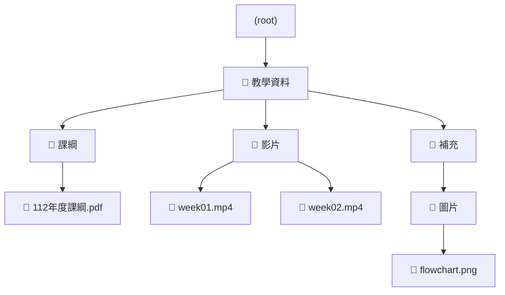

還記得當年在做 LMS 時，有個功能是讓老師儲存所有教材素材，

一開始看起來超單純，就像是：「給老師一個 Google Drive 放教案」

可以上傳影片、PPT、PDF，還能建資料夾分類、拖拉搬動

當時我作為 PM 心裡的預估是：「這就是個檔案列表 + 資料夾結構，兩週搞定」

結果工程師只問我一句：「資料夾可以無限巢狀嗎？」

我說：「當然」

他點點頭：「好，那你知道這對資料庫代表什麼嗎？」

我那時不懂，但後來懂了

## UI 看起來是樹，資料結構卻不能照 UI 走

素材庫 UI 的樣子很清楚：

```
📁 教學資料
  ├─ 📁 課綱
  │    └─ 📄 112年度課綱.pdf
  ├─ 📁 影片
  │    ├─ 📄 week01.mp4
  │    └─ 📄 week02.mp4
  └─ 📁 補充
       └─ 📁 圖片
             └─ 📄 flowchart.png
```

**這是一棵樹沒錯，但你不能在資料庫裡存一棵樹。**

你永遠不會知道老師會建幾層，

更不可能為每一層建不同的欄位或表。

你只能用一種方式來描述這個結構：

> 所有東西都有一個 parentId
> 

## 所有素材都是一個 node，靠 parentId 串成一棵邏輯樹

我們最後用了這樣的設計模型：



這棵看似巢狀的結構，其實在 DB 裡只是**一張平面表**：

```sql
id| parent_id| type| name| owner_id
---|-----------|--------|-------------------|----------
1|NULL| folder| 教學資料| T123
2|1| folder| 課綱| T123
3|2| file|112年度課綱.pdf| T123
4|1| folder| 影片| T123
5|4| file| week01.mp4| T123
6|4| file| week02.mp4| T123
7|1| folder| 補充| T123
8|7| folder| 圖片| T123
9|8| file| flowchart.png| T123

```

查詢的時候，邏輯很簡單：

- 要列出一層 → `SELECT * FROM nodes WHERE parent_id = ?`
- 要往下展 → 用前端遞迴呼叫 API
- 要搬家 → 更新 `parent_id`

## 為什麼這個模型能撐住實戰需求？

因為 LMS 裡素材庫會不斷長出額外功能，例如：

- 拖拉搬移素材 → 只要改 `parent_id`
- 資料夾排序 → 多一欄 `order_index`
- 回收桶 → 多一欄 `deleted_at`
- 搜尋 → 把 `name` / `type` / `created_at` 納入搜尋欄位
- 權限控管 → 加 `owner_id` 或 `shared_to_user_id`

但不管怎麼加，**核心 schema 完全不用動**

這對一個 PM 來說很有感：「資料結構不會拖累新功能，是產品最穩的骨架」

## 小總結

當時做的只是 LMS 裡一個「放教材的地方」

但後來我才意識到，數據結構或是 SCHEMA 這種東西

不是工程師的事而已

> 理解技術底層，會直接影響你怎麼拆需求、設計功能、跟工程師溝通
> 

也能站在業務角度提前預判，高發場景，提前跟研發討論預案

parentId 看起來只是個欄位

但那其實是整個系統「撐得住、長得出來」的關鍵

對一個懂程式的 PM 來說，這才是值得記住的部分