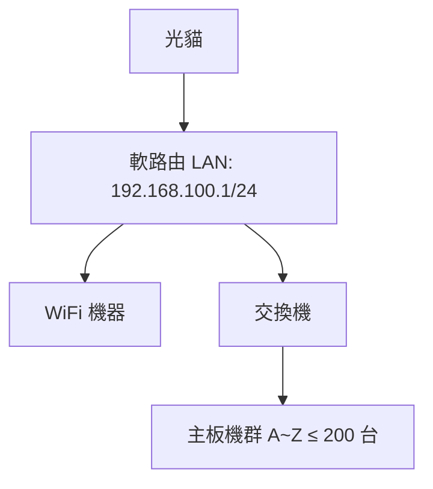

大家在搭建手機主板機房時，最大的痛點往往不是硬體，而是**網路**

怎麼讓 50 台、100 台甚至 200 台以上的設備同時穩定運轉？怎麼確保每一台都能順暢上網、同步任務、不掉線？

> **核心概念只有一個：對網路架構拓樸有概念**

這篇文章，我們用非本科也能懂的方式，把你需要知道的名詞、架構、頻寬規劃一次講清楚，讓你直接照著搭建

## 先搞懂三個你必須認識的網路名詞

在進入架構之前，先把這三個名詞刻在腦子裡。不懂這些，後面都是霧裡看花。

### 1. 光貓（Optical Modem）

光貓就是「光纖數據機」，是你跟中華電信或其他 ISP 之間的分界點。

> **一句話：光貓是你家的「網路入口」。**

它接收從外面拉進來的光纖訊號，把電信公司的訊號轉成家裡能用的網路線訊號。

你可以把它想像成「自來水總開關」：外面水管送來的水，先進到這裡，再分給家裡每個水龍頭。光貓不做任何聰明的事，它只負責把光變成電。

### 2. 軟路由（Soft Router）

軟路由可以想像成「一台特製的電腦，專門幫你管家裡或機房的網路」。

它負責做三件事：

- **分配房間號碼（DHCP）**：當有新手機或主板接進來時，它會幫每台機器分配一個獨一無二的 IP，確保大家不會撞號
- **交通指揮（NAT / Routing）**：所有機器要上網，都先把資料交給軟路由，軟路由像交通警察，把這些資料打包、標好號碼，再送到外面的網路
- **守門員（Firewall / VLAN）**：可以設定誰能進來、誰不能進來，也能限制某些機器的速度，或把不同的群組分在不同的區域，避免互相干擾

### 3. 交換機（Switch）

> **一句話：交換機就是「網路版延長線」**

軟路由的 LAN 口通常只有一個。好比牆上的插座只有一個孔，你要插 50 台設備，就必須接上一條延長線，把一個孔分成很多孔，大家才能一起用電

交換機做的事情一模一樣：把一個網路口「分接」成很多口，讓所有主板機都能同時上網，而且每個孔都能跑到滿速，不會因為設備多就卡住

## 拓樸：網路世界的建築藍圖

對這些設備有概念之後，我們來講**拓樸（Topology）**。

用蓋房子來比喻：你在蓋房子的時候，會先畫藍圖，決定水管怎麼走、插座在哪裡，確保未來所有房間都有水有電。

**網路的拓樸就像這張藍圖**，先規劃好：

- 網線要怎麼拉
- 哪裡要分岔
- 哪裡要有總閘門（軟路由）
- 哪裡要有配管中心（交換機）

> **如果沒有拓樸概念，隨便拉線，很容易遇到 IP 衝突、設備不通、速度卡爆**

## 200 台手機以內的架構方案（基礎關）

200 台手機是一個主觀的分水嶺，也是大多數人剛起步會遇到的規模。

為什麼叫「窗口」？因為主板機本身不會有螢幕（原始狀態只有主板跟供電模組），需要透過軟體把螢幕投射到電腦上，投到電腦上就變成一個個手機視窗，所以才稱為「窗口」。

### 基礎拓樸長這樣：

這是最標準的一條光纖網路架構。光貓接到軟路由，再分三條線出去：

- **WiFi**：提供管理用筆電或手機上網
- **千兆交換機**：接所有手機主板

只要把子網掩碼和 DHCP 設定好，這個架構就能穩定容納 200 台以內的設備。

### 網速怎麼抓？（以滑動 IG + 上傳內容為例）

估算頻寬要看「每台設備平均要吃多少」。

以 IG 為例，短影片大約需要 1.5–3 Mbps 下行。
假設 200 台同時看影片，抓平均 2 Mbps：

> 200 × 2 Mbps = **400 Mbps**
> 再加 20% 安全係數 → 約 **480 Mbps**

下行大約要準備 **500 Mbps** 才穩。

上行幾乎不吃什麼流量，但如果要上傳限動、影片，建議上行預留 **50–100 Mbps**，避免同時上傳卡住。

> **換句話說：如果你要跑滿 200 台，建議直接升級到 1G/600M 光世代方案，或者至少 500M/250M 以上。**

## 拷問二：200 台以上的擴展策略（進階關）

當設備數量突破 200 台，最大的問題不是交換機插不下，而是——

> **IP 不夠用**

### 子網掩碼：決定你的「街」可以住多少人

拓樸保持一樣：光貓 → 軟路由 → WiFi / 管理機 / 交換機。

不同的是，你要調整**子網掩碼**，讓網段可以容納更多設備。

用一個比喻來理解：

想像你住在一條街上，街名是 `192.168.100`，門牌號碼就是最後一個數字。

預設的子網掩碼 `255.255.255.0`（/24），表示這條街只有 **254 個門牌號碼**可以用：
`192.168.100.1` ~ `192.168.100.254`

如果不夠住，你就要把街弄長一點——把隔壁街打通，變成一條更長的街。

例如把子網掩碼改成 `255.255.254.0`（/23），現在你就能用到兩條街：
`192.168.100.x` 和 `192.168.101.x`
總共 **510 個門牌號碼**。

### 子網掩碼與軟路由 LAN 設定的關係（這一步搞錯，全盤皆輸）

子網掩碼不是單獨存在的，它是 **LAN 介面的一部分設定**。

LAN（Local Area Network）就是軟路由負責的「內網」，所有手機主板、管理機、交換機都透過這個介面互相連線。

當你在軟路由上設定 LAN：
- 有一個 IPv4 Address（例如 `192.168.100.1`）
- 有一個 Subnet Mask（例如 `255.255.255.0`）

這兩個設定共同決定了：
1. LAN 的網段（例如 `192.168.100.x`）
2. 這個網段可以容納多少台設備

> **關鍵動作：當你想要把網段從 /24 擴到 /23，必須在 LAN 設定裡把子網掩碼改掉。**

改完之後，軟路由才知道「現在整個 192.168.100.x + 192.168.101.x 都是我的內網」，然後 DHCP 才會正常發 IP 給 101.x 的設備。

> **常見的致命錯誤：只改 DHCP 範圍、不改 LAN 的子網掩碼。**
>
> 軟路由會認為 101.x 是「外部網段」，導致設備雖然拿到 IP，卻無法跟其他機器互通。整間機房的設備互相看不到對方，直接全軍覆沒。

### 網速怎麼抓？

原本 200 台就需要 500 Mbps 下行。
如果擴展到 400 台，建議至少 800 Mbps，或者直上 1G 甚至 2G 對稱專線更好。

同樣留 20% 安全係數，避免高峰期塞車。

## 不需要多 WAN，不需要多條光纖，先把一件事做對

| 規模 | 關鍵設定 | 頻寬建議 |
| :--- | :--- | :--- |
| ≤ 200 台 | /24 子網（254 IP）| 500 Mbps 下行 |
| 200–500 台 | /23 子網（510 IP）| 1 Gbps 下行 |

對於 200 台以內的群控機房，只要有一條穩定的光纖、一台軟路由、一台千兆交換機，就能把網路打穩。

當你要突破 200 台，**只需要改子網掩碼**，讓更多設備能拿到 IP，就能輕鬆擴展到 500 台以上。

> **不用急著買多 WAN 口的軟路由，也不用多拉一條光纖。**
>
> 因為如果只有一條光纖，多 WAN 沒有意義。只要把頻寬升級、子網掩碼設定好，就能讓機房持續穩定運行。

先把這件事做對，再去煩惱其他的