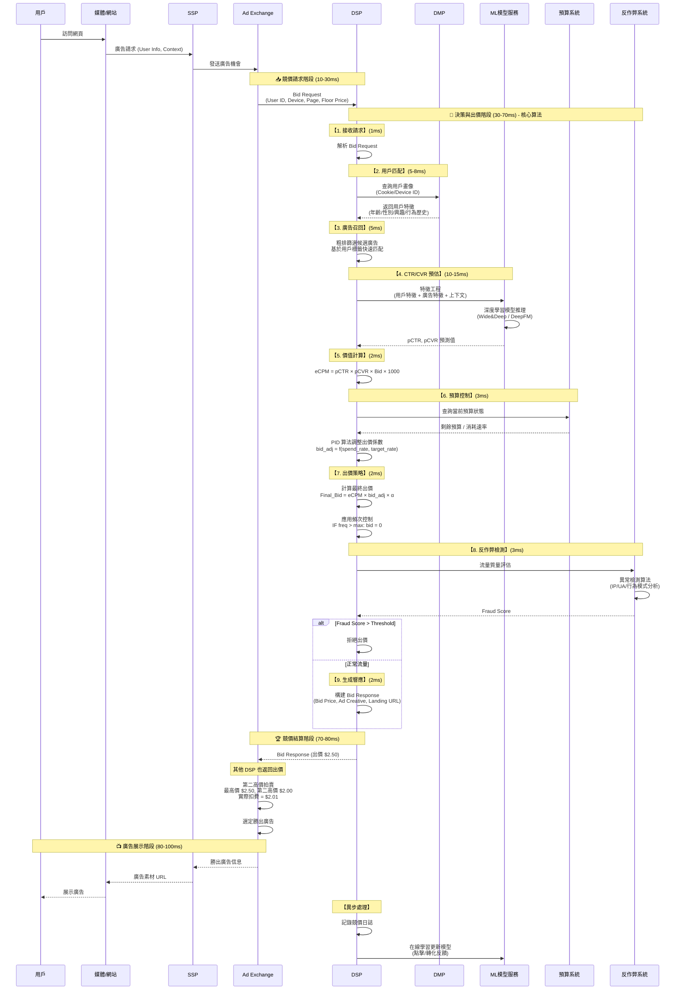

如果說廣告產業是一場無形的戰爭，那 RTB（Real-Time Bidding）就是它的戰場規則

你滑動螢幕、打開網站、點開影片時，背後可能已有數十個演算法正在爭奪你的注意力

整個過程只花 **100 毫秒**，卻決定了誰能「出現在你面前」

## 從「預約廣告」到「即時決策」

在傳統廣告時代，品牌與媒體談好價格、簽下檔期、設定投放

但在 RTB 裡，這一切都被拆解成毫秒級的競價機制

每一次曝光都是一場新拍賣

沒有人事先保證誰能買到版位，也沒有人能確定會賣給誰

**唯一能決定結果的，是演算法**

RTB 的運作離不開四個系統角色：

- **SSP（Supply-Side Platform）**：代表媒體，把流量整理成商品
- **DSP（Demand-Side Platform）**：代表廣告主，用模型決定出價與受眾
- **Ad Exchange**：像交易所一樣，撮合雙方
- **DMP（Data Management Platform）**：負責提供用戶特徵與行為資料

這四個環節組成了一個毫秒級的市場結構

## RTB 的運作流程

RTB 的流程不是線性，而是並行

它更像是一個在毫秒間「廣播－回應－結算」的分散式系統

先看整體的時序圖

我們接著來一步步解析整體的核心節奏：

### 廣告請求（0–10ms）

當使用者進入網站時，瀏覽器向 SSP 發出一個請求

裡面包含：

- 使用者識別（Cookie 或 Device ID）
- 裝置資訊（手機／桌機、作業系統）
- 頁面分類與廣告位尺寸

這一步只是個信號，意即：「我這裡有個廣告空位，要不要來搶？」

### 競價請求（10–30ms）

SSP 把這個請求送到 Ad Exchange

而交易所會同時把它「廣播」給數十個 DSP

這不是排隊，而是**同時決策**

每個 DSP 都會收到一份 Bid Request

內容含用戶特徵、廣告位規格、底價、甚至頁面 URL

短短十幾毫秒，整個市場啟動

### DSP 決策（30–70ms）

這是 RTB 的核心，也是整個演算法密集度最高的環節

一個成熟的 DSP，在 30~40 毫秒內必須完成以下步驟：

1. **解析請求（1ms）**：解開 JSON，提取必要欄位
2. **用戶匹配（5–8ms）**：向 DMP 查詢該用戶的過往行為與特徵
3. **廣告召回（5ms）**：從上萬條廣告中篩出符合條件的候選
4. **CTR/CVR 預測（10–15ms）**：用模型預估點擊與轉化率
5. **價值計算（2ms）**：算出該曝光的 eCPM
6. **預算控制（3ms）**：檢查投放節奏是否過快
7. **出價策略（2ms）**：乘上策略係數，生成最終出價
8. **反作弊檢測（3ms）**：過濾假流量
9. **生成響應（2ms）**：返回出價與素材連結

換句話說，DSP 就像一台微型交易伺服器

它不只是出價，而是在**毫秒之內做出「要不要買這個人」的判斷**

### 競價結算（70–80ms）

Ad Exchange 收到所有出價後，

會採用「第二高價拍賣」（Second-Price Auction）：

> A：$63 B：$58 C：$70 D：$45
> 

最高價 C 勝出，但實際支付 **$63.01**

這樣的機制鼓勵 DSP 出真實價值

否則市場會陷入無限猜測與壓價

### 廣告展示（80–100ms）

Ad Exchange 將勝出的素材返回 SSP

再由網站回傳至瀏覽器

畫面更新的那一瞬間，一次競價就結束了

整個循環僅 100 毫秒，卻同時串聯數十個平台、數百萬筆資料

## RTB 的技術本質

RTB 並不是「廣告系統變快」

而是「市場結構被微分化」

在過去，一次廣告交易可能以天為單位進行

現在，每一次曝光都能被重新定價

**這讓注意力成為真正的即時資產**

因此，DSP 不再只是出價邏輯

而是一個「即時價值預測引擎」

它的競爭力，不在誰算得多，而在誰算得準