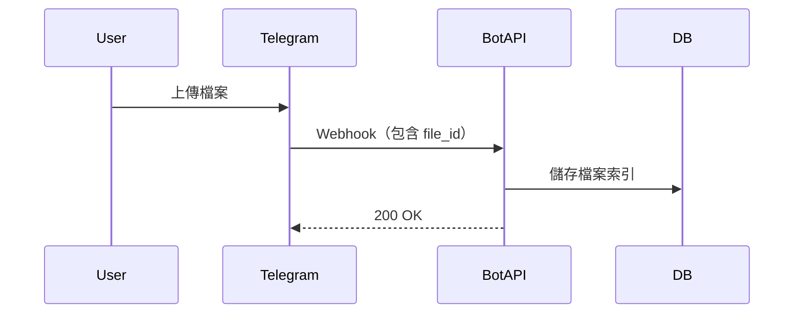
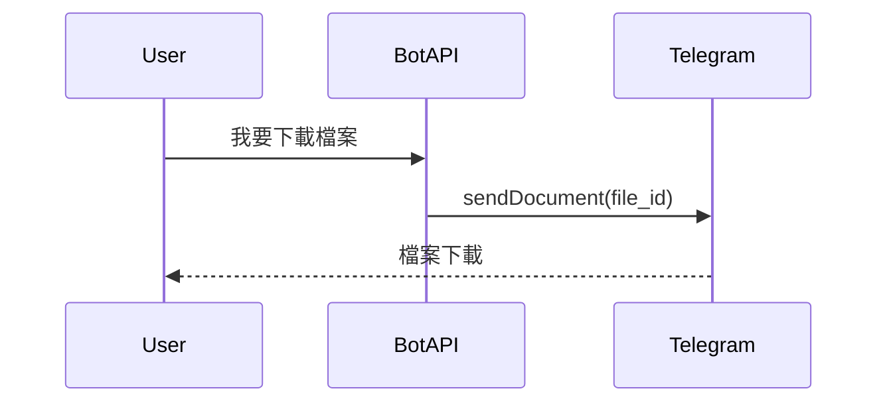

如果你有用過 Telegram 的雲盤型機器人，大概都會冒出同一個疑問：

> 「為什麼它看起來像無限空間？上傳下載都很快，還不用自己買硬碟？」

答案其實不神祕，只是把 Telegram 本身的能力用到了極限。

但如果你以為這是某種黑魔法，那這篇就是來幫你除魅的。

## 先打掉一個幻想——雲盤不是雲盤，是「索引系統」

> **Telegram 雲盤機器人，不存檔案本體**

它真正存的東西只有兩種：
- 使用者資料
- Telegram 的 `file_id`

而真正幫你扛儲存、扛頻寬、扛下載的，不是機器人，不是你的後端，而是 Telegram 自己的基礎設施

**你把檔案上傳給機器人，它只是把檔案的「門牌號碼」記下來而已**

## 核心入口：Webhook，而不是 Long Polling

既然是雲盤，就肯定有很多使用者；既然有很多使用者的 Bot，幾乎一定是走 **Webhook** 架構。

為什麼？

- 使用者上傳檔案是高頻事件
- 下載、轉傳、分享全都是 API 請求
- Long Polling 單點扛不住，也不好水平擴展

Webhook 架構下，Bot 本質上就是一個 Web API：

> **關鍵洞察：Webhook 收到的不是檔案本身，而是檔案的「描述資訊」。**

值得提的一點是：如果使用者一次發送多個文件，Telegram 還會幫它們冠上同一個 `media_group_id`，讓你可以針對這一批檔案做批次處理。這個設計，是後面資料流設計的重要前提

## 真正的魔法——Telegram 的 file_id 機制

Telegram 在處理檔案時，有一個對 Bot 極度友善的設計：

> **每一個檔案上傳成功後，都會得到一個 file_id。**

這個 `file_id` 代表什麼？

- 它指向 Telegram 內部的實體檔案
- 只要你有這個 id，就可以：
  - 重新下載
  - 轉傳給其他人
  - 再次發送，不用重新上傳

而且重點是：

> **使用 file_id 再次發送檔案，不會佔用你的頻寬與儲存**

這就是整個雲盤機器人的魔法來源。不是你的後端厲害，是 Telegram 幫你扛了一切

## 下載與分享的真相：其實是在「重送訊息」

當使用者要下載檔案時，Bot 並不是：
- 去某個 Storage 抓檔案
- 再轉傳給使用者

而是：

注意這個流程：
- **Bot 沒碰到檔案內容**
- **Bot 沒吃下載頻寬**
- **所有流量都在 Telegram 內部完成**

這也是為什麼：
- 檔案再大也不怕
- 下載人數一多也不會把 Bot 打死
- 你不需要買任何儲存空間或 CDN

> **本質揭露：雲盤機器人不是儲存服務，它是一個「在 Telegram 的無限硬碟上幫你建立索引目錄」的服務**

## Trade-off：file_id 只是入口，資料流設計才是地基

到這裡，你可能會覺得：「喔，所以就是靠 file_id 嘛，那也沒什麼」

錯！file_id 只是入場券

> **真正決定你這套系統能不能長期穩定跑下去的，從來都不是 Telegram 給你的能力，而是你自己在背後怎麼設計資料流**

當使用者一次傳來 20 個、50 個檔案，你怎麼穩穩地處理、正確地入庫，才是這套系統「成為雲盤」的關鍵。

### 單次入庫 vs. 分批入庫：技術實作的決策點

當一批檔案收齊之後，要一次全部寫入 DB，還是分批寫入？這個決策，會直接影響你係統的穩定性邊界。

#### 模式一：單次入庫（Bulk Insert）

當判斷所有項目都已經收齊，就觸發一次性批次處理，把整批資料一起存進資料庫。

**優點：**
- 實作簡單，對應一個 Webhook 邏輯處理流程
- 避免出現資料一半進、一半沒進的情況
- 整批 commit，資料一致性好

**缺點：**
- 如果資料量太大（例如一次 100 張圖），可能造成資料庫瞬間壓力過大
- 寫入失敗的容錯成本高：要嘛全進，要嘛全炸

**適合場景：**
- 檔案量預期不會太大（10–20 筆以下）
- 一致性需求較高的場景（例如順序有意義、必須完整才可用）

#### 模式二：分批入庫（Chunk Insert）

當資料收齊之後，不是一次全丟進 DB，而是**分段**（例如 10 筆一批）慢慢寫入。

**優點：**
- 對資料庫友善，IO 壓力平均分攤
- 任一小批寫失敗，不影響其他批次，可追蹤與補償
- 可以平滑處理大檔案數量，使用者一次拖 100 筆進來也不怕

**缺點：**
- 會出現「部分寫入成功」的過渡狀態，要額外處理 UI 同步與資料一致性
- 需要設計好錯誤補償、重試機制

**適合場景：**
- 批次數量不固定、可能超大（20–100+）
- 寧願資料慢一點全到，也不想壓垮 DB
- 資料一致性需求沒那麼極端（成功率優先於順序）

## 這不是儲存系統，這是一個資料控制系統

Webhook 接住了流量，Redis 吞下了過渡期，但最終還是得落在資料庫裡，才能說這批檔案「真的被收下來了」

> **file_id 讓你不用扛儲存、不吃頻寬**
> **但當使用者一次傳來 50 個檔案，你怎麼穩穩地處理、正確地入庫，才是這套系統的工程核心**

這就是 file_id 背後真正的工程本質：

Telegram 給你的是免費的無限倉庫，但倉庫的進出貨管理系統，你得自己蓋