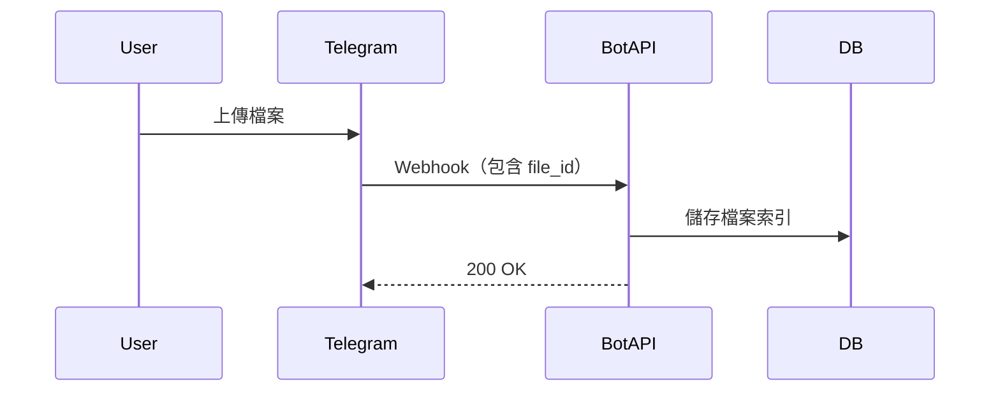
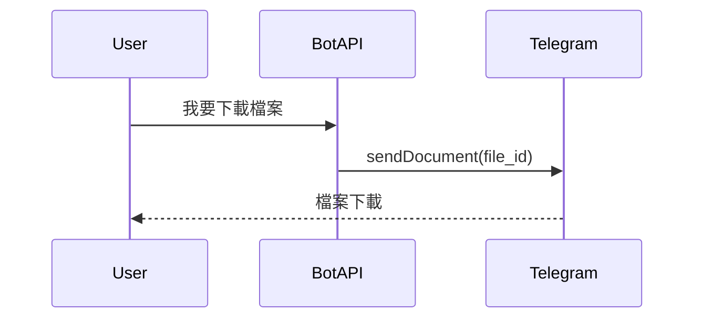

如果你有用過 Telegram 的雲盤型機器人，大概都會冒出同一個疑問：

> 為什麼它看起來像「無限空間」？
> 
> 
> 上傳、下載都很快，還不用自己買硬碟？
> 

答案其實不神祕，只是把 Telegram 本身的能力用到極限

這篇就來拆解一個典型的 Telegram 雲盤機器人，看看它在 Webhook 架構下是怎麼跑的，以及它到底是怎麼做出近乎無限儲存與頻寬的效果的秘密

## 先講結論：雲盤不是雲盤，是「索引系統」

先把一個幻想打掉：Telegram 雲盤機器人，不存檔案本體

它真正存的東西只有兩種：

- 使用者資料
- Telegram 的 `file_id`

而真正幫你扛儲存、扛頻寬、扛下載的，不是機器人，而是 Telegram 自己的基礎設施

## 核心入口：Webhook，而不是 Long Polling

既然是雲盤，就肯定有很多使用者；既然有很多使用者的 Bot，幾乎一定是 Webhook 架構

原因很簡單：

- 使用者上傳檔案是高頻事件
- 下載、轉傳、分享都是 API 請求
- Long Polling 單點扛不住，也不好擴

Webhook 架構下，Bot 本質上就是一個 Web API：

重點在這裡就已經出現了：

Webhook 收到的不是檔案，而是檔案的「描述資訊」

值得提的一點是，如果使用者一次發送很多文件，還會被冠上同一個 media_group_id

讓你可以針對這一個批次的檔案做處理

## 真正的關鍵：Telegram 的 file_id 機制

Telegram 在處理檔案時，有一個對 Bot 極度友善的設計：

> 每一個檔案，上傳成功後，都會得到一個 file_id
> 

這個 `file_id` 代表什麼？

- 它指向 Telegram 內部的實體檔案
- 只要你有這個 id，就可以：
    - 重新下載
    - 轉傳給其他人
    - 再次發送，不用重新上傳

而且重點是：

> 使用 file_id 再次發送檔案，不會佔用你的頻寬與儲存。
> 

這就是整個雲盤機器人的魔法來源

## 下載與分享：其實是在「重送訊息」

當使用者要下載檔案時，Bot 並不是：

- 去某個 Storage 抓檔案
- 再轉給使用者

而是：

注意這個流程：

- Bot 沒碰到檔案內容
- Bot 沒吃下載頻寬
- 所有流量都在 Telegram 內部完成

這也是為什麼：

- 檔案再大也不太怕
- 下載人數一多也不會把 Bot 打死

## 單次入庫＆分批入庫：技術實作的決策點

在一個上傳的行為裡面， 用戶可能會上傳很多個檔案，在技術實作上通常會先在接收到 telegram 傳來的消息時，先暫存在 redis 裡面，但後續鐵定要把暫存的資料入庫做持久化

這時候的設計決策會長出兩種做法：

> 當這一批檔案都收齊之後，要一次全部寫入 DB，還是分批寫入？
> 

### 模式一：**單次入庫（bulk insert）**

當判斷所有項目都已經收齊，就觸發一次性批次處理，把整批資料一起存進資料庫

優點：

- 實作簡單，對應一個 webhook 邏輯處理流程
- 避免出現資料一半進、一半沒進的情況
- 整批 commit，資料一致性好

缺點：

- 如果資料量太大（ex: 一次 100 張圖），可能造成資料庫瞬間壓力過大
- 寫入失敗的容錯成本高：要嘛全進，要嘛全炸（除非手動切 transactions）

適合場景：

- 檔案量預期不會太大（10~20 筆以下）
- 一致性需求較高的場景（例如順序有意義、必須完整才可用）

### 模式二：**分批入庫（chunk insert）**

當資料收齊之後，不是一次全丟進 DB，而是**分段**（例如 10 筆一批）慢慢寫入。

你可以用 Queue、Worker 或簡單的 async loop 來實作，依你系統的風格而定。

優點：

- 對資料庫友善，IO 壓力平均分攤
- 任一小批寫失敗，不影響其他批次，可追蹤與補償
- 可以平滑處理大檔案數量，例如使用者一次拖 100 筆進來也不怕

缺點：

- 會出現「部分寫入成功」的過渡狀態，要額外處理 UI 同步、資料一致性
- 需要設計好錯誤補償、重試機制

適合場景：

- 批次數量不固定、可能超大（20~100+）
- 寧願資料慢一點全到，也不想壓垮 DB
- 資料一致性需求沒那麼極端（例如：素材批次上傳成功率優先於順序）

## file_id 只是入口，資料系統才是地基

Telegram 雲盤機器人表面上是靠 `file_id` 撐起來的沒錯

但真正決定你這套系統能不能長期穩定跑下去的

從來都不是 Telegram 給你的這些能力

而是你自己在背後怎麼設計資料流

`file_id` 讓你不用扛儲存、不吃頻寬

但當使用者一次傳來 20 個、50 個檔案

你怎麼穩穩地處理、正確地入庫，才是這套系統「成為雲盤」的關鍵

Webhook 接住了流量，Redis 吞下了過渡期

但最終還是得落在資料庫裡，才能說這批檔案「真的被收下來了」

這就是 file_id 背後真正的工程：

不是在省錢，而是在做一個極限節流下的資料控制系統