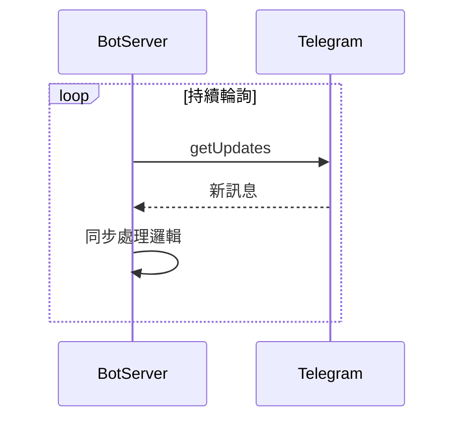
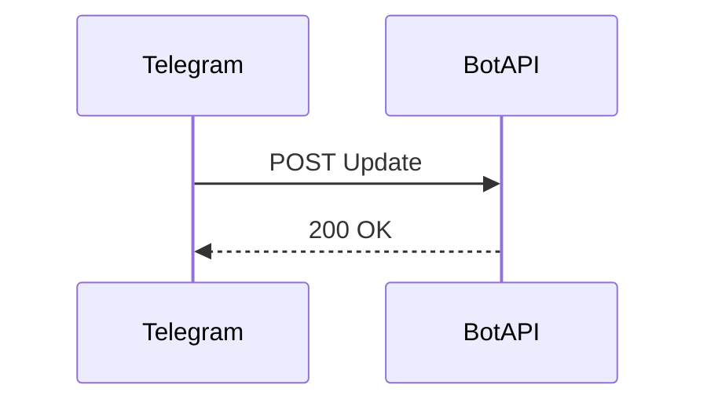
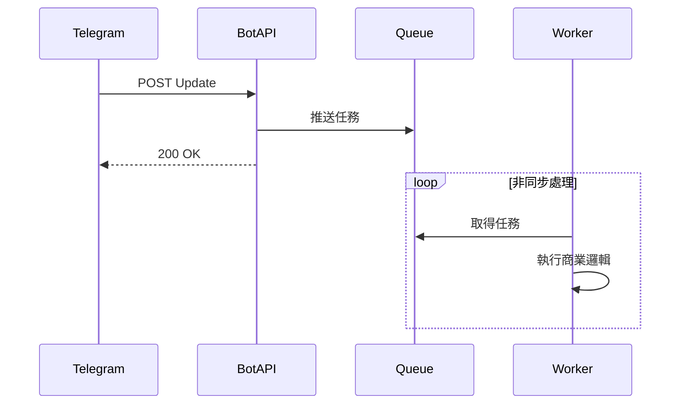

如果你有寫過 Telegram Bot，大概都會在某一天卡在這個問題：

我現在到底要用 Long Polling，還是 Webhook？

表面上看起來只是「接訊息的方式不同」

實際上這個選擇，會決定你的 Bot 是玩具，還是產品

## Telegram 機器人是怎麼收到訊息的？

先講一個很多人一開始沒意識到的事：

> Telegram 不會幫你把訊息送進程式碼裡
> 
> 
> 你必須選一種方式，自己把它「接」回來
> 

Telegram 官方只給你兩條路：

- Long Polling
- Webhook

兩種都能跑，但適合的場景完全不同

## Long Polling：一個人扛全場

Long Polling 的概念很單純：

> Bot Server 一直問 Telegram：「有新訊息嗎？」
> 

流程大概是這樣：

好處很明確：

- 不用 HTTPS
- 不用對外開服務
- 本機跑得動，上線也跑得動

對小 Bot 來說，這是最省事的選擇

### 但 Long Polling 有一個致命設定

同一個 Bot Token，同一時間只能有一個接收者

白話一點就是：

- 你只能有一台機器在收訊息
- 所有請求都塞在同一個 Process
- 你想加機器，Telegram 不讓

所以 Long Polling 的本質是：

單點接收、單點壓力、單點風險

流量一來，你就會開始懷疑人生

## Webhook：比較像正常後端系統

Webhook 的方向剛好相反：

Telegram 有訊息，就直接打 HTTP 給你

流程會變成：

這時候你的 Bot 就不再是一個「輪詢程式」

而是一個標準的 Web API

### Webhook 真正的價值：可以水平擴展

Webhook 能解決 Long Polling 做不到的事：

- 前面接 Load Balancer
- 後面多台機器一起扛
- 流量大就加節點

這也是為什麼**只要是正式產品，最後都會走 Webhook**

## 但 Webhook 有一個隱藏成本：你不能慢

Webhook 有一個 Telegram 沒明講，但大家都會踩到的坑：

請你快點回我，問題是，Bot 常做的事情偏偏都很慢：

- 查資料庫
- 打第三方 API
- 跑金流、風控
- 大量 IO

如果你把這些都塞在 Webhook request 裡

結果通常不是 timeout，就是重送，然後系統開始變複雜

## 正確姿勢：Webhook 只收件，事情丟給 Queue

比較不痛的做法會長這樣：

這個架構只在乎一件事：不要讓 Telegram 等你

Webhook 的責任只有接住請求並快速回應

真正吃重、吃慢、會失敗的事情，交給 Worker

## 你不是在選技術，你是在選天花板

- 小工具、個人 Bot、流量不大 👉 Long Polling 很舒服
- 正式產品、需要擴展、不能掛 👉 Webhook + Queue 幾乎是標配

Long Polling 讓你快速開始

Webhook + Queue，讓你在流量來的時候還睡得著

如果你現在還在猶豫，其實答案只有一個問題：

你這個 Bot，會不會長大？

如果會，那你遲早會走到這裡