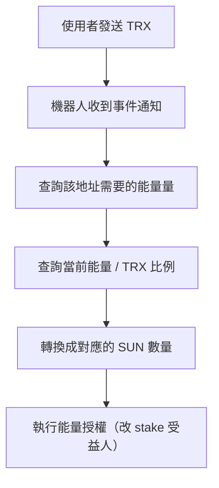

如果你有在寫區塊鏈相關的 Telegram 機器人，大概都會知道兩個字很重要：

> **能量（Energy）**

尤其在 TRON（波場）這條鏈上，你只要有任何跟合約互動的需求，就繞不開能量機制

這篇文章來拆解我之前做的一個「波場能量租賃機器人」。說穿了整套系統邏輯很簡單，**核心就兩件事**：

1. 監聽地址上的交易行為
2. 處理波場的質押與能量授權

但中間牽扯到一些實務抉擇、鏈上邏輯與數據單位處理，還是值得整理記錄下來

## 地址監聽——事件觸發的起點，也是第一個 Trade-off

這類能量租賃機器人，第一個需求一定是：

> **使用者把 TRX 傳給某個地址，我要知道**

說起來很簡單，但實作上就是兩個選擇，而且這兩個選擇的「場景邊界」非常清楚

### 方案一：用 Trongrid 定時輪詢交易紀錄

- 定時呼叫 Trongrid API：`getTransactionsToAddress`
- 把每個地址的交易拉出來，比對有沒有新交易
- 額外處理「已確認」、「重複處理」等狀態同步問題

**優點**：你完全掌控流程，不依賴第三方

**缺點**：一旦監聽地址多起來，API 請求成本會上天，而且很難 scale。你還得自己扛資料一致性、網路延遲、重試機制、負載瓶頸... 每一項都是技術債

### 方案二：使用類似 Tatum 的 Webhook 機制

這類服務提供：
- 註冊你要監聽的地址
- 當有交易事件時，自動發 Webhook 到你指定的 URL
- 你只負責處理「收到了什麼」

**代價**：有服務費

> **我最後選了方案二。原因很現實：地址一多，怎麼樣都要花錢**
>
> 既然都要付錢，與其自己去扛那些基礎設施的維運地獄，不如乾脆交給三方的成熟服務處理。把工程資源集中在「收到事件之後要做什麼」，才是這個產品真正的核心邏輯

## 波場質押 + 能量授權，整套能量的核心結構

### 2.1 波場鏈質押：選擇能量，還是帶寬？

TRON 的 staking 機制目前是 V2，意思是：

> **你把 TRX 質押進去，可以選擇要獲得「能量」或「帶寬」**

兩者的差別：

| 資源類型 | 消耗場景 | 適用情境 |
| :--- | :--- | :--- |
| **能量（Energy）** | 合約互動（TRC20 轉帳、智能合約 call） | 跟 DApp、USDT 轉帳有關 |
| **帶寬（Bandwidth）** | 原生 TRX 轉帳 | 基本轉帳、訊息 |

> **這裡的選擇很關鍵**
>
> 因為我們的機器人目的是提供「能量租賃」，所以在質押的時候，就必須明確指定要獲得 Energy。選錯，整套系統的根基就錯了

### 2.2 能量授權 ≠ 把能量轉給別人（這是最大的認知誤區）

很多人一開始以為，能量授權的意思是：

> 「我有能量，我分一點給你」

但實際上 TRON 的設計是這樣：

> **你 stake 的 TRX 本體仍屬於你，但你可以把「受益人（Beneficiary）」設成其他人**

換句話說：

> **你不是轉能量給對方，而是把你 stake 出來的能量，掛到別人的地址下使用**

這裡有幾個實務上必須搞清楚的細節：

- 授權時用的單位不是 TRX，而是 **SUN**（1 TRX = 1,000,000 SUN）
- 你需要去鏈上抓一個當下的換算比例：「每 1 TRX stake 出來會產多少能量」
- 然後反推：「這個使用者要消耗多少能量 → 我該 stake 多少 TRX（轉成 SUN）來授權」

整個授權流程長這樣：



> **關鍵洞察：這個流程的本質，不是「轉帳」，而是「改權限」。你改的是受益人欄位，不是餘額**

### 2.3 跟鏈上互動：用 RPC 組交易 + TronWeb 簽名送出

質押與授權本身也是合約操作，你需要跟鏈上互動。

實務上的流程：

- 透過 TronGrid 或自架 RPC，把 stake、授權等操作組出交易物件
- 把這些交易交給 TronWeb 簽名
- 最後廣播出去

TronWeb 的流程基本上就是：

```js
const unsignedTx = await tronWeb.transactionBuilder.stake(...)
const signedTx = await tronWeb.trx.sign(unsignedTx)
const result = await tronWeb.trx.sendRawTransaction(signedTx)
```

整體來說這段並不困難，重點在於：

- **交易參數正確**（單位是 SUN，不是 TRX）
- **RPC 網路穩定**（鏈上操作，延遲就是成本）
- **記得 stake 結束後會有「冷卻期」**，部分資產會被鎖定幾天才能退回。這是機制的內建限制，不是 bug

## 這不是產品，這是對鏈的運作邏輯做拆解

這個能量租賃機器人，其實不是什麼正式產品

只是我當時為了理解 TRON 整套資源機制做的小實驗

- 怎麼監聽地址？→ 在輪詢跟 Webhook 之間做取捨
- 怎麼質押？→ 搞清楚能量跟帶寬的場景邊界
- 怎麼授權？→ 理解「受益人」這個欄位的真正意義
- 怎麼算能量？→ 學會在 SUN 跟 TRX 之間換算

每一步，都是在對鏈的實際運作邏輯做拆解

> **對我來說，這不是在寫一個 bot**
> **而是用 side project 的方式，去研究「鏈可以怎麼被用」**

功能不多，但把鏈摸熟了很多