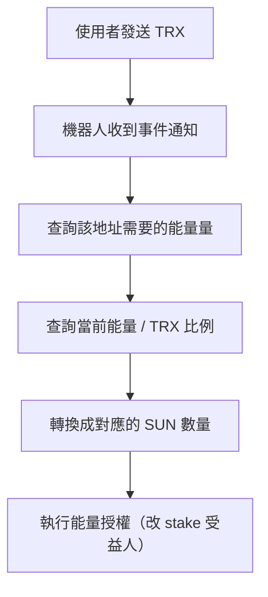

如果你有在寫區塊鏈相關的 Telegram 機器人，大概都會知道兩個字很重要：

> 能量（Energy）
> 

尤其在 TRON（波場）這條鏈上，你只要有任何跟合約互動的需求，就繞不開能量機制。這篇文章來拆解一下我之前做的一個「波場能量租賃機器人」，說穿了整套系統邏輯很簡單，**核心就兩件事**：

1. 監聽地址上的交易行為
2. 處理波場的質押與能量授權

但中間牽扯到一些實務抉擇、鏈上邏輯與數據單位處理，還是值得整理記錄一下。

---

## 1. 地址監聽：事件觸發的起點

這類能量租賃 bot，第一個需求一定是：

> 使用者把 TRX 傳給某個地址，我要知道。
> 

說起來很簡單，但實作上就兩個選擇：

### 方案一：用 Trongrid 定時輪詢交易紀錄

- 定時呼叫 Trongrid API：`getTransactionsToAddress`
- 把每個地址的交易拉出來，比對有沒有新交易
- 額外處理「已確認」、「重複處理」等狀況

這種作法好處是：你完全掌控流程；

缺點也很明顯：**一旦監聽地址多起來，API 請求成本會上天，而且很難 scale。**

---

### 方案二：使用類似 Tatum 的 webhook 機制

這類服務提供類似：

- 註冊你要監聽的地址
- 當有交易事件時，自動發 webhook 到你指定的 URL
- 你只負責處理「收到了什麼」

這種方式會有服務費，但我最後還是選了這個方案。

> 原因很現實：地址一多，怎麼樣都要花錢。
> 

既然都要付錢，與其自己去扛資料一致性、網路延遲、重試機制、負載瓶頸，不如乾脆交給三方的成熟服務處理。

---

## 2. 波場質押 + 能量授權：整套能量的核心結構

---

### 2.1 波場鏈質押：選擇能量 or 帶寬

TRON 的 staking 機制目前基本上是 V2，意思是：

> 你把 TRX 質押進去，可以選擇要獲得「能量」或「帶寬」
> 

兩者的差別是：

- **能量（Energy）**：合約互動會消耗（例如 TRC20 轉帳、智能合約 call）
- **帶寬（Bandwidth）**：原生 TRX 轉帳消耗（例如基本轉帳、訊息等）

這裡的選擇很關鍵，因為我們的機器人目的是提供「能量租賃」，所以在質押的時候就得特別標明要選擇 Energy。

---

### 2.2 能量授權 ≠ 把能量轉給別人

很多人一開始以為，能量授權的意思是：

> 我有能量，我分一點給你。
> 

但實際上 TRON 的設計是這樣：

> 你 stake 的 TRX 本體仍屬於你，但你可以把「受益人（受益帳號）」設成其他人。
> 

換句話說，你不是轉能量給對方，而是 **把你 stake 出來的能量，掛到別人的地址下使用**。

這裡有幾個實務要注意的點：

- 授權時用的單位不是 TRX，而是 **SUN**（1 TRX = 1,000,000 SUN）
- 所以你需要去鏈上抓一個當下的換算比例：「每 1 TRX stake 出來會產多少能量」
- 然後反推出：「這個使用者要消耗多少能量 → 我該 stake 幾 TRX（轉成 SUN）來授權」

整個授權流程會長得像這樣：



---

### 2.3 和鏈上互動：用 RPC 製作交易細節 + TronWeb 簽名送出

最後，質押與授權本身也是合約操作，你會需要跟鏈上互動。

實務上我們是這樣做的：

- 透過 TronGrid 或自架 RPC 把 stake、授權、投票等操作組出交易物件
- 把這些交易交給 TronWeb 簽名
- 最後廣播出去即可

TronWeb 的流程基本上就是：

```jsx
const unsignedTx =await tronWeb.transactionBuilder.stake(...)
const signedTx =await tronWeb.trx.sign(unsignedTx)
const result =await tronWeb.trx.sendRawTransaction(signedTx)

```

整體來說這段並不困難，重點在於：

- 交易參數正確
- RPC 網路穩定
- 記得 stake 結束後會有「冷卻期」，有些資產會被鎖定幾天才能退回

## 結語：不是為了做產品，只是想搞懂鏈怎麼運作

這個能量租賃機器人，其實不是什麼正式產品

只是我當時為了理解 TRON 整套資源機制做的小實驗

怎麼監聽地址、怎麼質押、怎麼授權、怎麼算能量

每一步都是在對鏈的實際運作邏輯做拆解

對我來說，這不是在寫一個 bot

而是用 side project 的方式去**研究「鏈可以怎麼被用」**

功能不多，但把鏈摸熟了很多