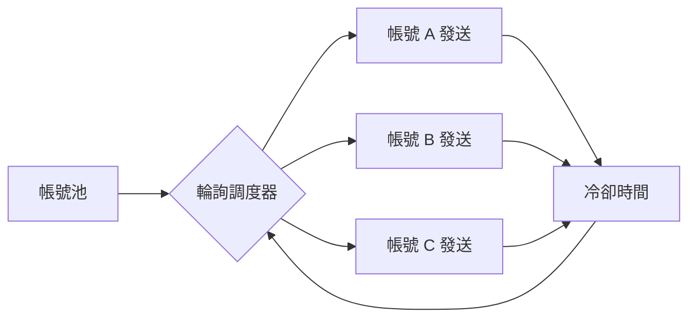

你在 Telegram 上一定遇過這兩種「垃圾引流」：

- 陌生帳號突然私訊你投放內容
- 莫名其妙被拉進某個群組或頻道（有時候還搭配機器人）

你以為這是 Bot API 在背後搞鬼？

> **不是。這類東西的本質，通常不是 Bot API，而是用 Telegram Client 在跑**

## 為什麼不是 Bot API？因為 Bot API 根本做不到

Bot API 的限制很多，尤其是「主動私訊不認識的使用者」這件事，從設計上就是不友善的

Bot 只能跟「已經和它互動過」的使用者對話。這是平台的鐵律

所以這類系統會直接用 **Telegram Client**——概念上就像你手機裡的 Telegram App，用程式去操作「使用者帳號」來發送訊息

> **關鍵差異只有一句話：**
>
> **Bot 是平台管得很死的接口；Client 是真人帳號本來就能做的事**

你用手機 Telegram 能做的事（私訊、拉群、加頻道），Client API 都能做。差別只在於，你不是用手按，是用程式跑

---

## Core：核心資產不是內容，是 Session String

這類系統最值錢的東西，不是訊息模板，不是文案，而是：

> **登入狀態（Session String / Session Data）**

為什麼？

因為只要 session 還有效，就代表：
- 不用每次都簡訊驗證
- 不用每次登入都觸發 Telegram 的安全通知
- 程式可以長期「以這個帳號的身份」發訊息、拉人、加群

整個流程是這樣：

1. 帳號先登入一次（可能透過手機號碼 + 驗證碼）
2. 把 session string 抽出來，存起來
3. 之後所有的操作，都靠這串 session 直接啟動 client，不再需要重複登入

> **Session String 的本質：不是密碼，是「登入狀態的快照」**

它讓你可以把一個真人的登入狀態，變成可以被程式重複使用的資源。這就是整座系統的地基

## 為什麼一定要用 DB 做持久化？因為你管的不是一個帳號，是一個帳號池

這套系統要管理的不是「一個帳號」，是**一個帳號池**

DB 存的不只是 session string，還會存每個帳號的「可用狀態」，概念上像這樣：

| 欄位 | 意義 |
| :--- | :--- |
| session_string | 登入憑證（核心資產） |
| status | 可用 / 冷卻 / 受限 / 已死 |
| last_sent_at | 最近一次發送時間 |
| consecutive_failures | 連續失敗次數（用來判斷風控或封鎖風險） |

> **Session 是鑰匙；DB 是你的帳號資源管理面板**

沒有 DB，你只是在亂發，發到帳號死光就沒了

有 DB，你才知道哪把鑰匙還能用、哪把該休息、哪把已經被 Telegram 風控系統盯上

## 群發的關鍵不是「發很多」，是「別讓帳號一次死掉」

Telegram 對 Client 行為會做風控：發太密、行為太機械、短時間大量私訊陌生人，就會觸發限制或直接封號

所以這套系統真正的核心邏輯不是爆量，而是：

> **分散風險、延長壽命**

這也是為什麼它幾乎一定會做「帳號輪詢」

## Round Robin 輪詢：不是為了平均負載，是為了生存

常見的輪詢策略長這樣：

- A 帳號發 N 則 → 換 B → 換 C → 回到 A
- 每個帳號之間插入冷卻時間（cooldown）
- 出現錯誤（例如 Telegram 回傳 flood wait）就把該帳號標記「降速」或「停用」

> **Round Robin 在這裡的目的不是效能，是生存**

它的核心價值在於：
- 降低單一帳號的發送密度
- 讓風控壓力分散到整個池子
- 某些帳號掛掉，也不影響整體繼續跑

所以你封鎖一個帳號，對這套系統來說，只是在池子裡拔掉一顆牙：

> **池子還在，輪詢還在，引流就還在**

## 核心概念

把道德跟用途先放一邊，純看系統本質，這類引流架構其實只做三件事：

1. 用 **Telegram Client** 操作真人帳號（因為 Bot 做不到）
2. 把 **Session String** 當成可重複使用的登入憑證，放進 DB 做狀態管理
3. 用 **Round Robin 輪詢調度** 分散風控壓力，延長整個帳號池的壽命

> **訊息內容只是耗材；真正被精心管理的是「帳號」本身。**

這套系統的工程本質不是「怎麼發訊息」，而是：

> **如何在一個不歡迎你的平台上，讓一群帳號盡可能活得久、發得多、死得慢**